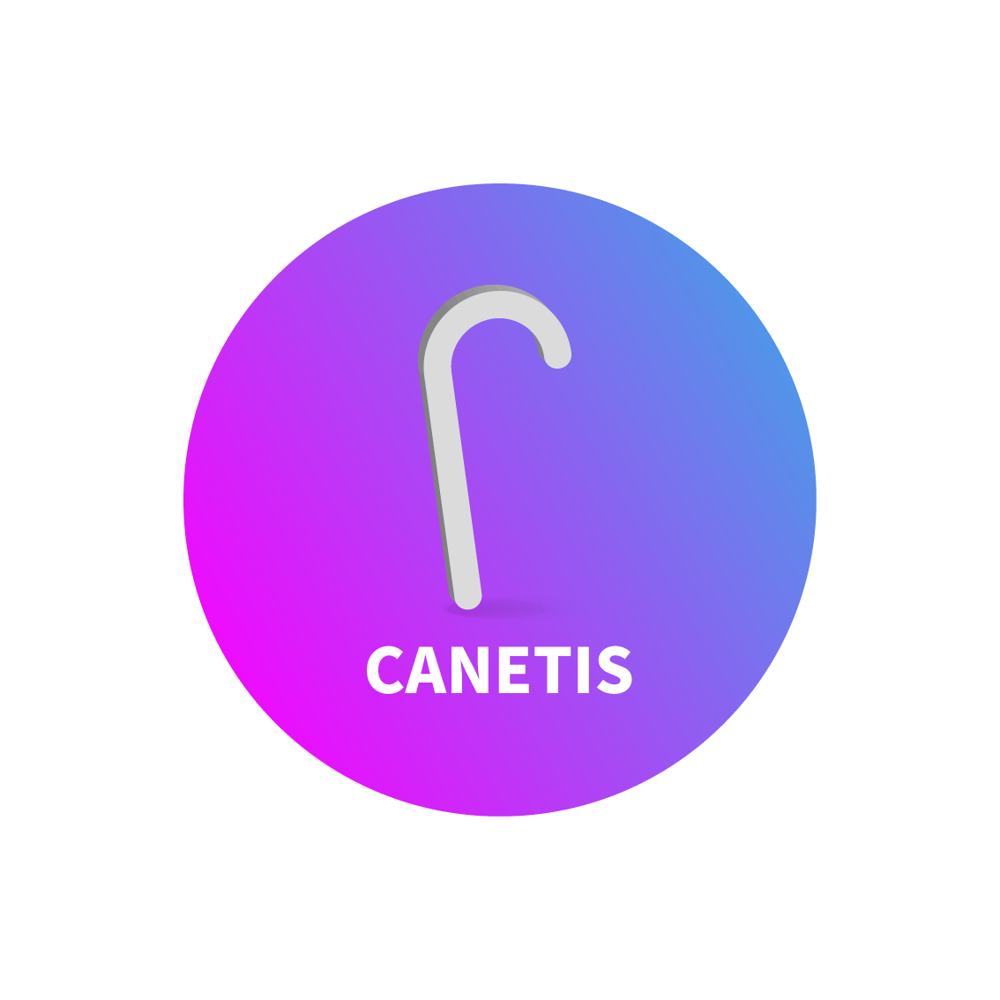

CANETIS - appjam-15
===================

Logo
----

Description
-----------

> Canetis project is the visually impaired. We developed with Node MCU.

Team Member
-----------

-	Arduino Developer, 이원준
-	Web&App UI/UX Designer & Developer, 박재성
-	Front-end Developer, 박평진
-	Back-end Developer, 김대운
-	Application Developer, 김지섭

App UI Demo
-----------

